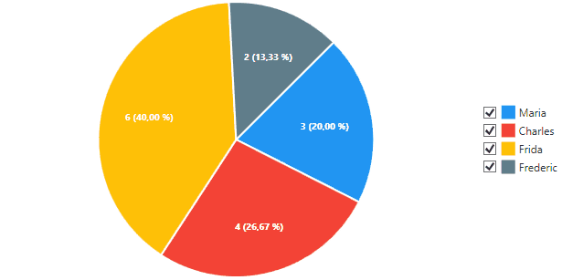

# lvchartssamples
Code samples for using/extending LiveCharts

## CustomLegendSample
Shows how to implement a custom chart legend which allows to toggle the visibility of series by a checkbox attached to each entry.
Described in this [blog post](https://www.renebergelt.de/blog/2018/05/interactive-legends-for-.net-livecharts/).

